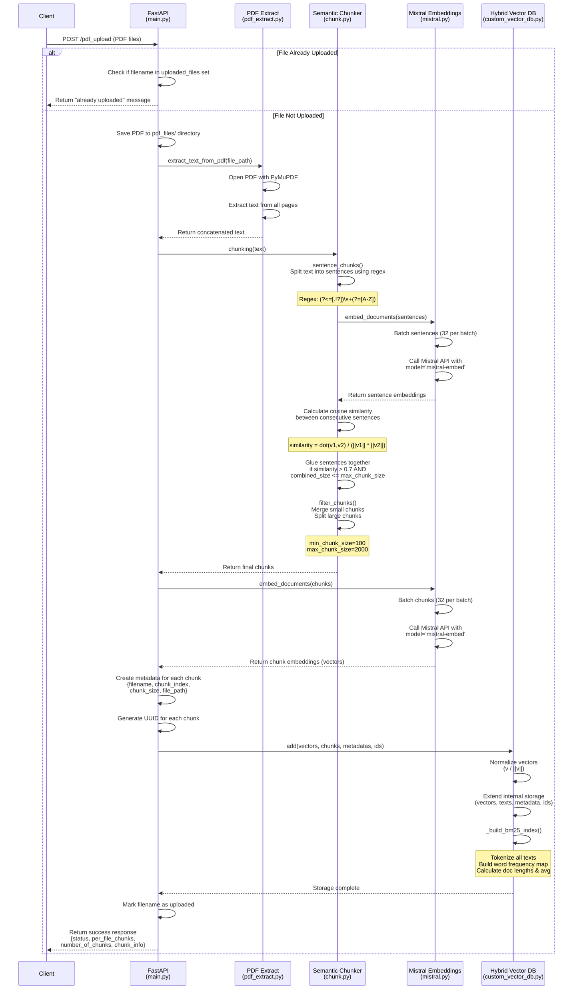

## Architecture Diagrams

### PDF Upload Pipeline

The following diagram illustrates the complete workflow of the `/pdf_upload` endpoint, from receiving a PDF file to storing it in the vector database:

**Key Steps:**
1. **File Check**: Verify if PDF already uploaded to avoid duplicates
2. **Text Extraction**: Use PyMuPDF to extract text from all pages
3. **Sentence Splitting**: Break text into sentences using regex patterns
4. **Sentence Embeddings**: Generate embeddings for each sentence via Mistral API
5. **Cosine Similarity**: Calculate semantic similarity between consecutive sentences
6. **Semantic Gluing**: Merge similar sentences (threshold > 0.7) up to max chunk size (2000 chars)
7. **Chunk Filtering**: Ensure chunks meet size constraints (100-2000 chars)
8. **Chunk Embeddings**: Generate final embeddings for semantic chunks
9. **Metadata Creation**: Attach filename, index, size, and path to each chunk
10. **Vector DB Storage**: Normalize vectors and store in custom database
11. **BM25 Index**: Build lexical search index with tokenization and word frequencies
