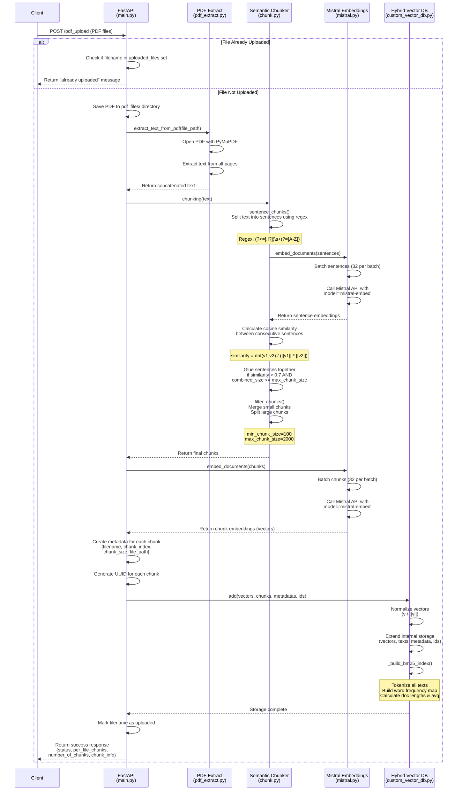
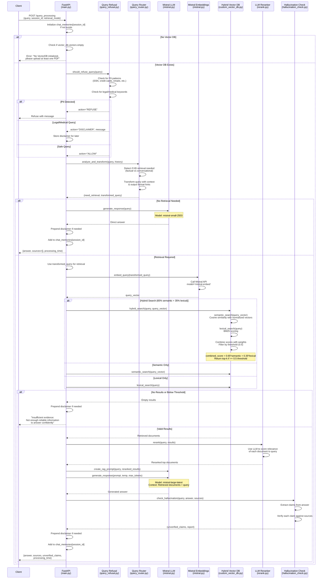

## Architecture Diagrams

### PDF Upload Pipeline

The following diagram illustrates the complete workflow of the `/pdf_upload` endpoint, from receiving a PDF file to storing it in the vector database:

**Key Steps:**
1. **File Check**: Verify if PDF already uploaded to avoid duplicates
2. **Text Extraction**: Use PyMuPDF to extract text from all pages
3. **Sentence Splitting**: Break text into sentences using regex patterns
4. **Sentence Embeddings**: Generate embeddings for each sentence via Mistral API
5. **Cosine Similarity**: Calculate semantic similarity between consecutive sentences
6. **Semantic Gluing**: Merge similar sentences (threshold > 0.7) up to max chunk size (2000 chars)
7. **Chunk Filtering**: Ensure chunks meet size constraints (100-2000 chars)
8. **Chunk Embeddings**: Generate final embeddings for semantic chunks
9. **Metadata Creation**: Attach filename, index, size, and path to each chunk
10. **Vector DB Storage**: Normalize vectors and store in custom database
11. **BM25 Index**: Build lexical search index with tokenization and word frequencies

### Query Processing Pipeline

The following diagram shows the complete RAG query processing flow with safety checks, intelligent routing, and hallucination detection:

**Key Steps:**
1. **Session Init**: Create or retrieve chat memory for session_id
2. **Vector DB Check**: Ensure at least one PDF uploaded
3. **Safety Check**: Refuse PII queries, add disclaimers for legal/medical
4. **Query Analysis**: Determine if KB search needed + transform query with context
5. **Direct Answer**: Use Mistral LLM (mistral-small-2503) for conversational queries
6. **Query Embedding**: Generate vector representation for retrieval queries
7. **Hybrid Search**: Combine semantic (65%) + BM25 (35%), filter by 0.5 threshold
8. **Insufficient Evidence**: Refuse to answer if no results meet threshold
9. **Reranking**: LLM-based reranking of retrieved documents
10. **Answer Generation**: Create RAG prompt with sources, generate with mistral-large-latest
11. **Hallucination Check**: Verify claims against retrieved context
12. **Response**: Return answer with sources and unverified claims report
